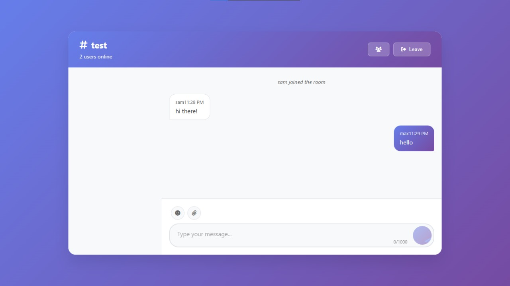

# 💬 Real-Time Chat App

This project was developed as part of my **CodeClause Internship**.  
It is a simple **real-time chat application** built with **Node.js, Express, and Socket.IO**.  
The app allows users to join rooms, send messages instantly, and see system updates when members join or leave.

---

## ✨ Features

- Real-time messaging powered by **Socket.IO**
- Room-based chat system (create or join rooms)
- System notifications for joins/leaves
- Responsive design (works on desktop & mobile)
- **Dark Mode support** 🌙
- **Emoji support** 😀 (send and display emojis in chat)
- **Media/file sharing** 📎 (share images, documents, etc.)
- Clean, minimal, modern design 

---

## 🚀 Live Demo

🔗 [View Live Project](https://codeclauseinternship-chatapp.onrender.com)  
🔗 [GitHub Repository](https://github.com/saumya-singh-1/CodeClauseInternship_ChatApp)

---

## 🛠️ Built With

- [Node.js](https://nodejs.org)  
- [Express.js](https://expressjs.com)  
- [Socket.IO](https://socket.io)  
- [HTML5, CSS3, JavaScript](https://developer.mozilla.org/en-US/docs/Web)

---

## 📸 Screenshots

### Join Room Page  

### Chat Room Example  

### Mobile View  

---
## 👨‍💻 Author

- **Saumya Singh**  
  GitHub: [@saumya-singh-1](https://github.com/saumya-singh-1)  
  LinkedIn: [@saumyasingh](www.linkedin.com/in/saumya-singh-946b63321/)  

---

## 🎯 Internship Note

This project was built as part of the **CodeClause Internship Program (2025)**.  
It helped me practice **real-time communication, backend development, and responsive UI design**.  
